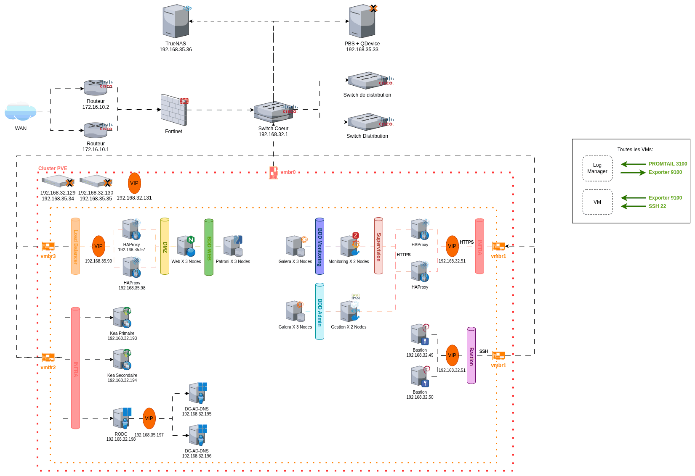

# 🏥 AISMediLab — Site de NUUK

<div align="center">

[](https://www.proxmox.com/)
[](https://app.terraform.io/)
[](https://www.ansible.com/)
[](https://www.packer.io/)
[](https://github.com/features/actions)
[](https://www.fortinet.com/)
[](https://www.debian.org/)
[](https://microsoft.com/)
[](https://mariadb.com/)
[](https://www.postgresql.org/)
[](https://www.haproxy.org/)
[](https://www.truenas.com/)
[](https://www.proxmox.com/en/proxmox-backup-server)
[]()
[]()

</div>

---

> Déploiement d'une infrastructure hautement disponible pour le site de **Nuuk** (Groenland/Danemark) du groupe **AISMediLab**, leader européen des services diagnostiques médicaux dans le cadre académique d'un Titre Professionnel Administrateur d'Infrastructures Sécurisées.  
> L'ensemble du provisionnement est piloté en **IaC** via Terraform (backend Terraform Cloud) et Ansible, déclenché par des **pipelines GitHub Actions**.

---

## 📐 Architecture

<div align="center">
  
</div>

---

## ⚙️ Pipeline CI/CD

Le déploiement est entièrement piloté par **GitHub Actions**. Chaque composant Terraform correspond à un workspace **Terraform Cloud** dédié, ce qui permet un déploiement séquentiel et isolé par couche. De plus le déploiement est découpé en x pipelines en fonction de la rareté du déploiement et l'isolation des composants.

```
Push / PR (main, feature/*)
    │
    ├─ 00. SecOps & Quality
    │   ├─ Gitleaks Scan                        (secrets dans l'historique git)
    │   ├─ Trivy IaC Scan                       (CRITICAL/HIGH → exit 1)
    │   └─ Lint & Validation
    │       ├─ terraform fmt -check -recursive
    │       ├─ terraform validate (par composant, backend=false)
    │       └─ ansible-lint (playbooks/)
    │
    ├─ 01. Socle - Infrastructure               (workflow_dispatch)
    │   ├─ [TF] Bastion                         → workspace nuuk-medilab-<env>-01-bastion
    │   │   ├─ [CLEAN] Proxmox si fail          (unlock VMID 401, 402)
    │   │   ├─ [HEALTHCHECK] ping + SSH :22
    │   │   └─ [ANS] 01_deploy_bastions.yml
    │   │
    │   ├─ [TF] DHCP (Node1 + Node2)            → workspace nuuk-medilab-<env>-02-core-infra
    │   │   ├─ [CLEAN] Proxmox si fail          (unlock VMID 701, 702)
    │   │   ├─ [HEALTHCHECK] ping + SSH :22
    │   │   └─ [ANS] 02_deploy_dhcp.yml
    │   │
    │   ├─ [TF] ADDNS                           → workspace nuuk-medilab-<env>-02-core-infra
    │   │   ├─ [CLEAN] Proxmox si fail          (unlock VMID 711, 712)
    │   │   └─ [HEALTHCHECK] ping + SSH :22
    │   │
    │   └─ [TF] RSYSLOG                         → workspace nuuk-medilab-<env>-02-core-infra
    │       ├─ [CLEAN] Proxmox si fail          (unlock VMID 501)
    │       ├─ [HEALTHCHECK] ping + SSH :22
    │       └─ [ANS] 03_deploy_syslog.yml
    │
    └─ 02. Data - Mgmt & Data                   (workflow_dispatch)
        ├─ [TF] BDD WEB (×3 nodes)              → workspace nuuk-medilab-<env>-03-data
        │   └─ [CLEAN] Proxmox si fail          (unlock VMID 1401–1403)
        │
        ├─ [TF] BDD ADM (×3 nodes)              → workspace nuuk-medilab-<env>-03-data
        │   └─ [CLEAN] Proxmox si fail          (unlock VMID 1501–1503)
        │
        └─ [TF] BDD MON (×3 nodes)              → workspace nuuk-medilab-<env>-03-data
            └─ [CLEAN] Proxmox si fail          (unlock VMID 1601–1603)
```

**Légende :**
  [TF]          → Terraform (apply | plan | destroy)
  [ANS]         → Ansible via bastion SSH (inventory dynamique Proxmox)
  [HEALTHCHECK] → ping + nc :22 avec timeout (180s réseau / 120s SSH)
  [CLEAN]       → SSH direct sur nœuds PVE pour qm unlock (continue-on-error=false)
  scope         → Tous | Sélection (booléens par composant)

### Secrets & Variables

Les secrets GitHub et les variables Terraform Cloud sont injectés via les **scripts de setup** disponibles dans `.github/`. Aucune valeur sensible n'est committée dans le dépôt.

| Catégorie | Variables |
|-----------|-----------|
| Proxmox API | `PM_API_TOKEN_ID`, `PM_API_TOKEN_SECRET`, `PM_API_URL` |
| Terraform Cloud | `TF_API_TOKEN`, workspace IDs par composant |
| Ansible | `ANSIBLE_SSH_PRIVATE_KEY`, `ANSIBLE_VAULT_PASSWORD` |
| Infrastructure | Plages IP, noms de domaine, credentials AD |

> ▶ Pour initialiser les secrets sur un nouveau runner, exécuter les scripts depuis `.github/` avant tout `terraform init`.

---

## 🗺️ Plan d'adressage

| Interface | Rôle | Réseau |
|-----------|------|--------|
| vmbr0 | Management Proxmox | 192.168.32.0/24 |
| vmbr1 | INFRA (AD/DHCP/DNS) | 192.168.32.128/26 |
| vmbr2 | DMZ / Web | 192.168.35.0/24 |
| vmbr3 | BDD | 192.168.35.192/26 |
| WAN | Inter-routeurs Fortinet | 172.16.10.0/30 |

### VIPs et services critiques

| Service | VIP / IP | Mécanisme HA |
|---------|----------|--------------|
| Bastion | 192.168.32.49 / .50 | Actif/Actif |
| HAProxy Web | VIP 192.168.35.99 | Keepalived |
| HAProxy INFRA | VIP 192.168.35.197 | Keepalived |
| Galera Admin | VIP 192.168.32.51 | Galera cluster |
| Patroni / PostgreSQL | VIP 192.168.32.131 | Patroni + etcd |
| Kea DHCP | .193 primaire / .194 secondaire | Kea failover |
| AD / DNS | .195 / .196 DC + .198 RODC | Multi-master |

---

## 📁 Structure du dépôt

```
.
├── .github/                          # Workflows GitHub Actions + scripts setup secrets
├── ansible/
│   ├── 01_deploy_bastions.yml
│   ├── 02_deploy_dhcp.yml
│   ├── 03_deploy_syslog.yml
│   ├── ansible.cfg
│   ├── inventory/
│   │   ├── group_vars/
│   │   │   ├── all.yml
│   │   │   ├── OS_WIN.yml            # Vars Windows Server
│   │   │   ├── ROLE-BAST.yml         # Bastions
│   │   │   ├── ROLE-BDD-WEB.yml      # Clusters BDD
│   │   │   ├── ROLE-DHCP.yml         # Kea DHCP
│   │   │   └── ROLE-RSYS.yml         # Syslog
│   │   └── inventory.proxmox.yml     # Inventaire dynamique Proxmox
│   ├── requirements.yml
│   ├── roles/
│   │   ├── common/                   # Base Debian (resolv.conf, sources.list)
│   │   ├── haproxy/                  # HAProxy
│   │   ├── kea-dhcp/                 # Kea DHCP4 + control agent
│   │   ├── keepalived/               # VIPs flottantes
│   │   └── syslog/                   # Syslog + config Fortigate
│   └── setup_env.sh                  # Bootstrap dépendances Ansible
├── packer/
│   ├── windows_desk/                 # Template Windows Desktop (Autounattend.xml)
│   └── windows_serv/                 # Template Windows Server 2022
├── terraform/
│   └── composants/
│       ├── 01_bastion/               # VMs bastions SSH
│       ├── 02_core_infra/            # AD, DNS, DHCP, supervision
│       ├── 03_databases/             # Galera + Patroni
│       ├── 04_management/            # Outils de gestion
│       └── 05_front_dmz/             # HAProxy + serveurs web
├── docs/
|   └── schema_architecture_infra.drawio
└── README.md
```

> Chaque composant `composants/0X_*/` possède son propre `backend.tf` pointant vers un workspace Terraform Cloud isolé — state files indépendants, pas de collision entre couches.

---

## 🛠️ Stack technique

| Catégorie | Technologie | Rôle |
|-----------|-------------|------|
| **Hyperviseur** | Proxmox VE | Cluster 3 nœuds |
| **Backend IaC** | Terraform Cloud | State files distants, un workspace par composant |
| **Provisionnement** | Terraform (HCL) | Création des VMs via API Proxmox |
| **Configuration** | Ansible + Jinja2 | Rôles : common, haproxy, kea-dhcp, keepalived, syslog,... |
| **Inventaire** | Proxmox dynamic inventory | `inventory.proxmox.yml` |
| **CI/CD** | GitHub Actions | Lint → Plan → Apply séquentiel par couche # A ajuster avec description pipelines |
| **Firewall** | Fortinet | Périmètre WAN, règles de flux, intégration syslog |
| **Load Balancer** | HAProxy + Keepalived | HA L4/L7, VIPs flottantes |
| **DHCP** | Kea DHCP4 | HA actif/passif + control agent |
| **DNS / AD** | Windows Server 2022 | Domaine `nuuk-medilab.lan` |
| **BDD** | MariaDB + Galera Cluster | 2 clusters × 3 nœuds (web + admin) |
| **BDD PG** | PostgreSQL + Patroni | Cluster 3 nœuds HA |
| **Stockage** | TrueNAS | NAS partagé NFS |
| **Backup** | Proxmox Backup Server | Sauvegardes VMs |
| **Supervision** | Promtail + Node Exporter | Logs (:3100) + métriques (:9100) |
| **Accès sécurisé** | Bastion SSH | Jump host isolé, seul point d'entrée SSH |

**Améliorations possibles :**
 - Implémentation d'un SIEM
 - Zabbix supervision + script automatique
 - 
---

## 🚀 Déploiement

### Prérequis

- Terraform ≥ 1.5 + compte **Terraform Cloud** (workspaces configurés)
- Ansible ≥ 2.15 + collections dans `requirements.yml`
- Packer ≥ 1.10 (pour rebuilder les templates Windows)
- Secrets initialisés via les scripts `.github/`

### 1. Initialiser les secrets

```bash
# Configure les secrets GitHub + variables TF Cloud
.github/<script_setup_secrets>
```

### 2. Déploiement via pipeline (recommandé)

```bash
# Un push sur main déclenche le pipeline complet
git push origin main

# Ou déclenchement manuel depuis l'UI GitHub Actions
```

### 3. Déploiement manuel (hors pipeline)

```bash
# Terraform — exemple pour le composant bastion
cd terraform/composants/01_bastion
terraform init
terraform plan -var-file="../../environnements/nuuk/formations.tfvars"
terraform apply -var-file="../../environnements/nuuk/formations.tfvars"

# Ansible
cd ansible
ansible-galaxy install -r requirements.yml
ansible-playbook -i inventory/inventory.proxmox.yml 01_deploy_bastions.yml
ansible-playbook -i inventory/inventory.proxmox.yml 02_deploy_dhcp.yml
ansible-playbook -i inventory/inventory.proxmox.yml 03_deploy_syslog.yml
```

### 4. Rebuilder les templates Packer

```bash
cd packer/windows_serv
packer init .
packer build windows-2022.pkr.hcl
```

---

## 📋 Contexte projet

**TP AIS — Administrateur d'Infrastructures Sécurisées** — Gaston Berger

**Risques adressés (audit pré-ISO 27001) :**
- Vol / ransomware de données de santé → segmentation VLAN, bastion, Fortinet
- SPOF hyperviseur historique → cluster Proxmox VE 2 nœuds + PBS
- Comptes non-nominatifs, mots de passe triviaux → AD HA + GPO
- Échanges de fichiers non sécurisés (WeTransfer) → flux internes chiffrés
- Hétérogénéité IT inter-laboratoires → standardisation IaC + images Packer

**SLAs maintenus :** résultat standard < 24h — résultat complexe < 72h

---

## 👤 Auteur

**Loïs Dutour** — [@cacti-lfs](https://github.com/cacti-lfs)
**Anthony**
**Allan**  
Bachelor AIS — DevOps / Infrastructure Sécurisée